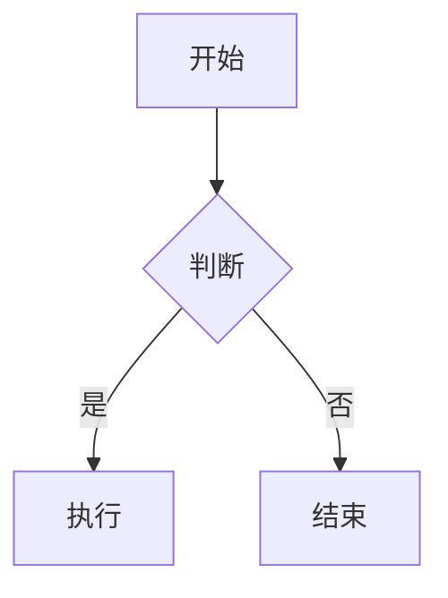

# MD.AI - Markdown 编辑器

一个现代化的 Markdown 编辑器，支持多平台运行，专为微信公众号排版优化。

## ✨ 功能特性

- 📝 **实时预览** - 左侧编辑，右侧即时预览
- 🎨 **多主题支持** - GitHub、微信优雅橙、清新绿、科技蓝
- 📐 **数学公式** - KaTeX 渲染 LaTeX 公式
- 📊 **流程图** - Mermaid 图表支持
- 🖼️ **图片粘贴** - 直接粘贴图片自动转 Base64
- 💻 **代码高亮** - 支持多种编程语言语法高亮
- 📱 **响应式设计** - 支持桌面和移动端

## 🚀 快速开始

### 安装依赖

```bash
npm install
```

### 启动开发服务器

```bash
npm run dev
```

访问 http://localhost:5173

### 构建生产版本

```bash
npm run build
```

## 📦 技术栈

- **前端框架**: React 19 + TypeScript
- **构建工具**: Vite 7
- **编辑器**: CodeMirror 6
- **Markdown**: marked.js + marked-highlight
- **数学公式**: KaTeX
- **流程图**: Mermaid
- **状态管理**: Zustand
- **代码高亮**: highlight.js

## 🎨 主题预览

| 主题 | 特点 |
|------|------|
| GitHub | 经典 GitHub 风格 |
| 微信-优雅橙 | 橙色调，适合技术文章 |
| 微信-清新绿 | 绿色调，清新自然 |
| 微信-科技蓝 | 蓝色渐变，科技感 |

## 📐 数学公式示例

行内公式：`$E = mc^2$`

块级公式：
```
$$
\sum_{i=1}^{n} x_i = x_1 + x_2 + \cdots + x_n
$$
```

## 📊 Mermaid 图表示例



## 🖼️ 图片支持

- **粘贴图片**: 直接 Ctrl+V / Cmd+V 粘贴剪贴板图片
- **拖拽上传**: 拖拽图片到编辑器区域
- **存储方式**: 自动转换为 Base64 内嵌

## 📁 项目结构

```
src/
├── components/
│   ├── Editor/         # CodeMirror 编辑器
│   ├── Preview/        # Markdown 预览
│   └── Toolbar/        # 工具栏
├── lib/
│   ├── markdown.ts     # Markdown 解析
│   ├── math.ts         # 数学公式渲染
│   ├── mermaid.ts      # 图表渲染
│   └── image.ts        # 图片处理
├── themes/             # 主题样式
├── stores/             # 状态管理
└── types/              # TypeScript 类型
```

## 🔮 后续计划

- [ ] Tauri 桌面应用封装
- [ ] 图床上传支持
- [ ] 文件管理功能
- [ ] 更多微信主题
- [ ] 大纲导航
- [ ] PDF 导出

## 📄 License

MIT
