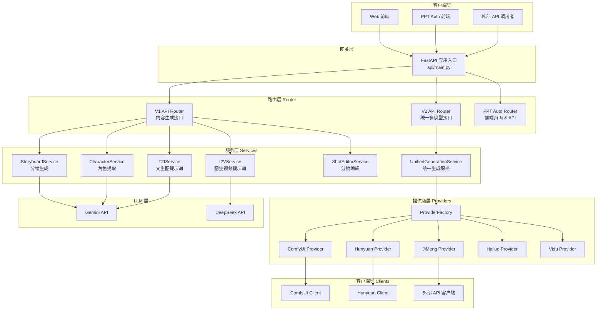
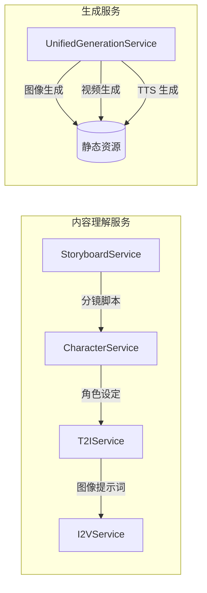
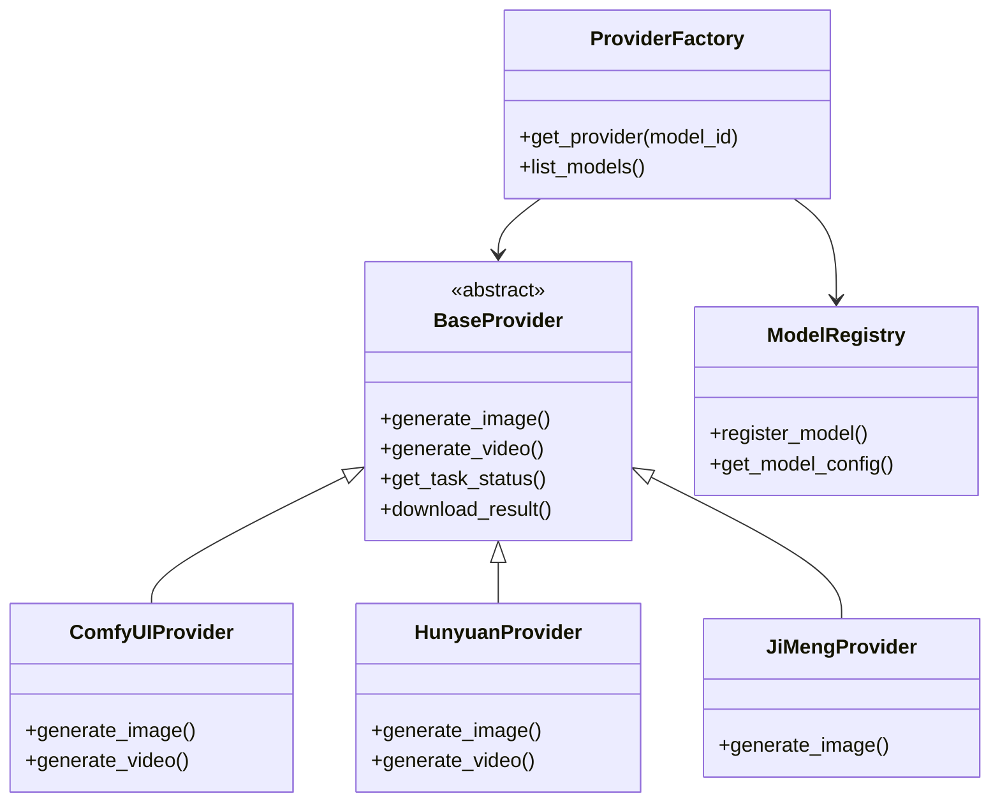
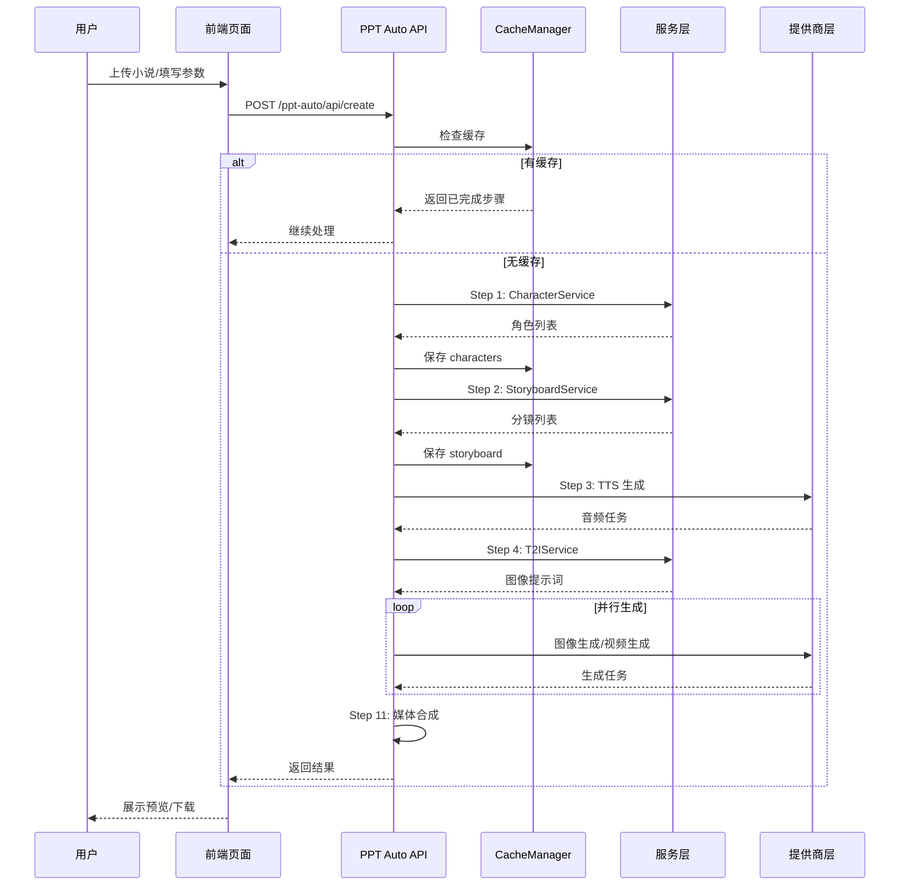
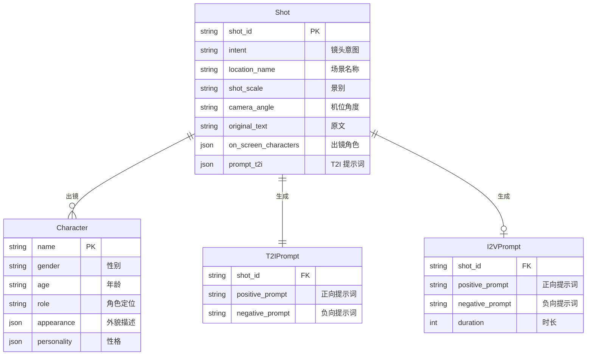

# Novel2Media API 设计文档

## 📖 项目概述

Novel2Media Web API 是一个基于 FastAPI 的专业 Web 服务，旨在将小说文本自动转换为影视化内容。本文档详细描述 API 的整体架构设计、核心接口规范，以及基于该 API 构建的 **PPT Auto** 自动化视频生成系统。
发送短发短发啊是短发

大幅度

是短发分


---

## 🏗️ 系统架构总览



---

## 📊 核心分层架构

### 1. 路由层 (Router Layer)

| 路由文件 | 前缀 | 职责 |
|---------|------|------|
| `api/router/v1.py` | `/api/v1` | 分镜/角色/提示词生成，单一模型图像视频生成 |
| `api/router/v2.py` | `/api/v2` | 统一多模型接口，支持多提供商切换 |
| `front_end_ppt_auto/api.py` | `/ppt-auto` | PPT Auto 前端页面和后端 API |

### 2. 服务层 (Service Layer)



### 3. 提供商层 (Provider Layer)

采用 **工厂模式 + 注册中心** 实现多模型提供商的统一管理：



**已集成提供商：**

| 提供商 | 模型类型 | 说明 |
|--------|---------|------|
| ComfyUI | T2I、I2V、唇形同步 | 本地化工作流引擎，可自定义工作流 |
| Hunyuan | T2I、I2V | 腾讯混元大模型 |
| JiMeng | T2I、I2I | 即墨图像生成 |
| Hailuo | TTS | 海螺语音合成 |
| Vidu | I2V | Vidu 视频生成 |

---

## 🔌 API V1 接口规范

### 接口列表

| 方法 | 路径 | 描述 |
|------|------|------|
| `POST` | `/api/v1/shot` | 生成分镜脚本 |
| `POST` | `/api/v1/character` | 提取并丰富角色信息 |
| `POST` | `/api/v1/character/edit` | 编辑角色（Brief 模式） |
| `POST` | `/api/v1/character/create` | 创建新角色 |
| `POST` | `/api/v1/shot_t2i_prompt` | 生成文生图提示词 |
| `POST` | `/api/v1/shot_i2v_prompt` | 生成图生视频提示词 |
| `POST` | `/api/v1/shot/edit` | 编辑分镜 |
| `POST` | `/api/v1/shot/create` | 创建新分镜 |
| `POST` | `/api/v1/generate_image` | 生成图像（ComfyUI） |
| `POST` | `/api/v1/generate_video` | 生成视频（ComfyUI） |
| `GET` | `/api/v1/loras` | 获取 LoRA 列表 |
| `GET` | `/api/v1/download/{task_id}` | 下载生成结果 |

### 标准响应格式

```json
{
    "code": 0,
    "message": "success",
    "data": { ... }
}
```

### 关键接口示例

#### 1. 分镜生成 `POST /api/v1/shot`

**请求体：**
```json
{
    "body": "李明站在教室门口，犹豫了一下，最终推门走了进去..."
}
```

**响应：**
```json
{
    "code": 0,
    "message": "success",
    "data": {
        "characters": [...],
        "shots": [
            {
                "shot_id": "S01_SH001",
                "intent": "李明站在教室门口，表情犹豫",
                "location_name": "教室",
                "shot_scale": "中景",
                "camera_angle": "平视",
                "on_screen_characters": [...],
                "original_text": "李明站在教室门口，犹豫了一下..."
            }
        ]
    }
}
```

---

## 🔌 API V2 统一接口规范

V2 版本提供 **统一的多模型调用接口**，通过 `model_id` 指定提供商和模型。

### 模型 ID 格式

```
{provider}:{model_name}
```

示例：
- `comfyui:qwen_v0.0.1` - ComfyUI Qwen 文生图
- `hunyuan:hunyuan_3.0` - 混元 3.0 文生图
- `jimeng:image2image_v3.0` - 即墨图生图
- `hailuo:text2speech_v2.6-hd` - 海螺 TTS

### 接口列表

| 方法 | 路径 | 描述 |
|------|------|------|
| `POST` | `/api/v2/generate_image` | 统一图像生成 |
| `POST` | `/api/v2/generate_image/three_view` | 三视图生成 |
| `POST` | `/api/v2/generate_image_from_image` | 图生图 |
| `POST` | `/api/v2/generate_video` | 统一视频生成（I2V） |
| `POST` | `/api/v2/generate_video/frames` | 首尾帧视频生成 |
| `POST` | `/api/v2/generate_video/references` | 多参考图视频生成 |
| `POST` | `/api/v2/video/lip_sync` | 视频唇形同步 |
| `POST` | `/api/v2/tts` | 统一语音合成 |
| `GET` | `/api/v2/task/{task_id}/status` | 任务状态查询 |
| `GET` | `/api/v2/task/{task_id}/download` | 下载任务结果 |
| `GET` | `/api/v2/models` | 列出可用模型 |
| `GET` | `/api/v2/providers` | 列出提供商 |

### 关键接口示例

#### 1. 统一图像生成 `POST /api/v2/generate_image`

**请求体：**
```json
{
    "model_id": "comfyui:qwen_v0.0.1",
    "positive_prompt": "A beautiful landscape with mountains and rivers",
    "negative_prompt": "blurry, low quality",
    "width": 1280,
    "height": 720,
    "lora_uuid": "wrz/吉卜力风格（宫崎骏）-qwen_1.0.safetensors"
}
```

**响应：**
```json
{
    "code": 0,
    "message": "success",
    "data": {
        "task_id": "abc123-def456",
        "status": "pending",
        "model_id": "comfyui:qwen_v0.0.1"
    }
}
```

#### 2. 统一视频生成 `POST /api/v2/generate_video`

**请求体：**
```json
{
    "model_id": "comfyui:wan2.2-i2v",
    "image": "base64_encoded_or_oss_url",
    "positive_prompt": "The girl slowly turns her head...",
    "negative_prompt": "blurry, distorted",
    "resolution": "1080p",
    "aspect_ratio": "16:9",
    "duration": 5,
    "fps": 24
}
```

---

## 🎬 PPT Auto 系统设计

PPT Auto 是基于上述 API 构建的 **自动化视频生成系统**，将小说文本一键转换为完整视频。

### 系统架构图

```mermaid
flowchart TB
    subgraph "输入"
        A[小说文本] --> B[PPT Auto 入口]
        C[配置参数<br/>风格/声优/分辨率]
    end
    
    subgraph "PPT Auto 核心流程"
        B --> D[Step 1: 角色提取]
        D --> E[Step 2: 分镜生成]
        E --> F[Step 3: 音频生成 TTS]
        F --> G[Step 4: T2I Prompt 生成]
        G --> H[Step 5: 图片生成]
        H --> I[Step 6: 字幕生成]
        I --> J[Step 7: I2V Prompt 生成]
        J --> K[Step 8: 视频任务准备]
        K --> L[Step 9: 视频生成]
        L --> M[Step 10: 资源下载]
        M --> N[Step 11: 视频合成]
    end
    
    subgraph "输出"
        N --> O[最终视频 MP4]
        N --> P[字幕文件 SRT]
        N --> Q[素材包 ZIP]
    end
    
    subgraph "缓存系统"
        R[CacheManager<br/>断点续传]
    end
    
    D -.-> R
    E -.-> R
    F -.-> R
    G -.-> R
    H -.-> R
    J -.-> R
    K -.-> R
    L -.-> R
```



### PPT Auto 处理流程详解



### PPT Auto API 接口

| 方法 | 路径 | 描述 |
|------|------|------|
| `GET` | `/ppt-auto` | PPT Auto 主页面 |
| `POST` | `/ppt-auto/api/create` | 创建生成任务 |
| `GET` | `/ppt-auto/api/task/{id}/status` | 获取任务状态 |
| `POST` | `/ppt-auto/api/task/{id}/cancel` | 取消任务 |
| `GET` | `/ppt-auto/api/task/{id}/preview` | 预览结果 |
| `POST` | `/ppt-auto/api/shot/{id}/regenerate_image` | 重新生成单帧图片 |
| `POST` | `/ppt-auto/api/shot/{id}/regenerate_video` | 重新生成单段视频 |
| `POST` | `/ppt-auto/api/shot/{id}/update_prompt` | 更新提示词 |
| `GET` | `/ppt-auto/api/vocal_options` | 获取声优列表 |
| `GET` | `/ppt-auto/api/lora_options` | 获取风格/LoRA 列表 |
| `GET` | `/ppt-auto/api/my_tasks` | 获取用户任务列表 |

### 创建任务请求

**`POST /ppt-auto/api/create`**

```json
{
    "novel_name": "萌宝降凡间",
    "novel_content": "小说完整文本内容...",
    "genre_type": "现代都市",
    "art_style": "新海诚风格，日式动画画面",
    "vocal_name": "晓辰-女声",
    "image_width": 1280,
    "image_height": 720,
    "video_percent": 0.5,
    "lora_uuid": "wrz/吉卜力风格-qwen_1.0.safetensors",
    "image_model_id": "comfyui:qwen_v0.0.1",
    "video_fps": 16
}
```

**响应：**
```json
{
    "code": 0,
    "message": "success",
    "data": {
        "task_id": "task-uuid-12345",
        "status": "processing",
        "current_step": "角色提取中...",
        "progress": 10
    }
}
```

### PPT Auto 内部模块

#### CacheManager（断点续传）

```python
class CacheManager:
    """
    缓存管理器 - 支持任务断点续传
    
    缓存步骤：
    - characters: 角色列表
    - storyboard: 分镜列表
    - cnt_video: 视频数量
    - speeches: 音频列表
    - speech_infos: 音频信息
    - t2i_prompts: T2I 提示词
    - images: 图片列表
    - i2v_prompts: I2V 提示词
    - video_tasks: 视频任务
    - videos: 视频列表
    - subtitle_path: 字幕路径
    """
```

#### MediaMerger（视频合成）

```python
async def merge_media_to_mp4(
    video_list,      # 视频片段列表
    image_list,      # 图片列表（用于纯图片镜头）
    speech_list,     # 音频列表
    subtitle_path,   # 字幕文件
    output_path      # 输出路径
) -> str:
    """合成最终视频"""
```

---

## 🔄 数据流转

### 分镜数据模型



---

## ⚙️ 配置说明

### 环境变量

| 变量名 | 必需 | 描述 |
|--------|------|------|
| `GEMINI_KEY` | ✅ | Google Gemini API Key |
| `DEEPSEEK_API_KEY` | ❌ | DeepSeek API Key |
| `COMFY_BASE_URL` | ❌ | ComfyUI 服务地址 |
| `COMFY_USERNAME` | ❌ | ComfyUI 用户名 |
| `COMFY_PASSWORD` | ❌ | ComfyUI 密码 |
| `HUNYUAN_HOST` | ❌ | 混元 AI 服务地址 |
| `HUNYUAN_AUTH` | ❌ | 混元 Basic Auth |
| `BASE_URL` | ✅ | API 服务基础 URL |
| `API_HOST` | ✅ | 监听地址 |
| `API_PORT` | ✅ | 监听端口 |
| `PORTAL_USERNAME` | ❌ | PPT Auto 登录用户名 |
| `PORTAL_PASSWORD` | ❌ | PPT Auto 登录密码 |

---

## 📁 目录结构

```
novelwebapi3_5/
├── api/                          # API 主目录
│   ├── main.py                   # FastAPI 应用入口
│   ├── router/
│   │   ├── v1.py                 # V1 API 路由
│   │   ├── v2.py                 # V2 API 路由
│   │   └── schema/               # 路由 Schema
│   ├── services/                 # 业务服务
│   │   ├── storyboard_service.py
│   │   ├── character_service.py
│   │   ├── t2i_service.py
│   │   ├── i2v_service.py
│   │   ├── unified_generation_service.py
│   │   └── ...
│   ├── providers/                # 多模型提供商
│   │   ├── base.py               # 基类
│   │   ├── factory.py            # 工厂
│   │   ├── registry.py           # 注册中心
│   │   ├── comfyui/
│   │   ├── hunyuan/
│   │   ├── jimeng/
│   │   ├── hailuo/
│   │   └── vidu/
│   ├── clients/                  # 外部客户端
│   ├── schemas/                  # Pydantic 模型
│   ├── workflows/                # ComfyUI 工作流 JSON
│   └── llm/                      # LLM 集成
│
├── ppt_auto/                     # PPT Auto 核心
│   ├── main.py                   # 主流程
│   ├── cache_manager.py          # 缓存管理
│   ├── media_merger.py           # 视频合成
│   └── utils/                    # 工具函数
│
├── front_end_ppt_auto/           # PPT Auto 前端
│   ├── api.py                    # 前端 API
│   ├── server.py                 # 静态服务
│   ├── templates/                # HTML 模板
│   └── static/                   # 静态资源
│
├── static/                       # 生成资源
│   ├── images/
│   └── videos/
│
└── logs/                         # 日志
```

---

## ✅ 验证计划

本文档为设计文档，无需验证代码实现。完成后请用户审核确认设计是否符合需求。

---

## 📝 文档修订

- **版本**: v1.0.0
- **创建日期**: 2026-01-07
- **作者**: Claude AI Assistant
