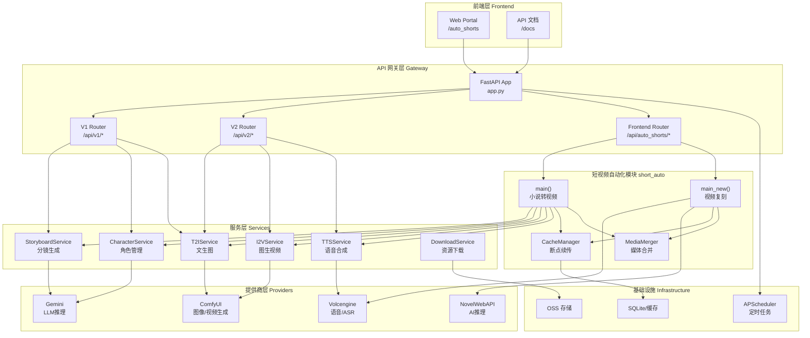
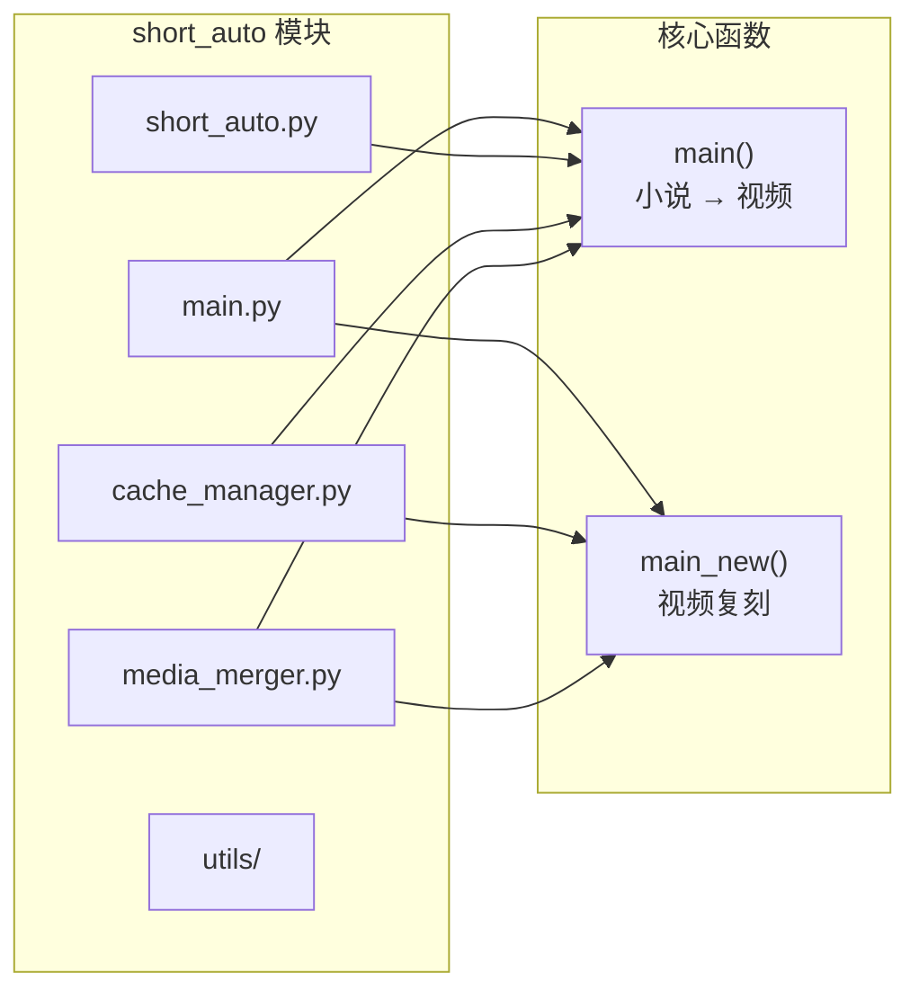
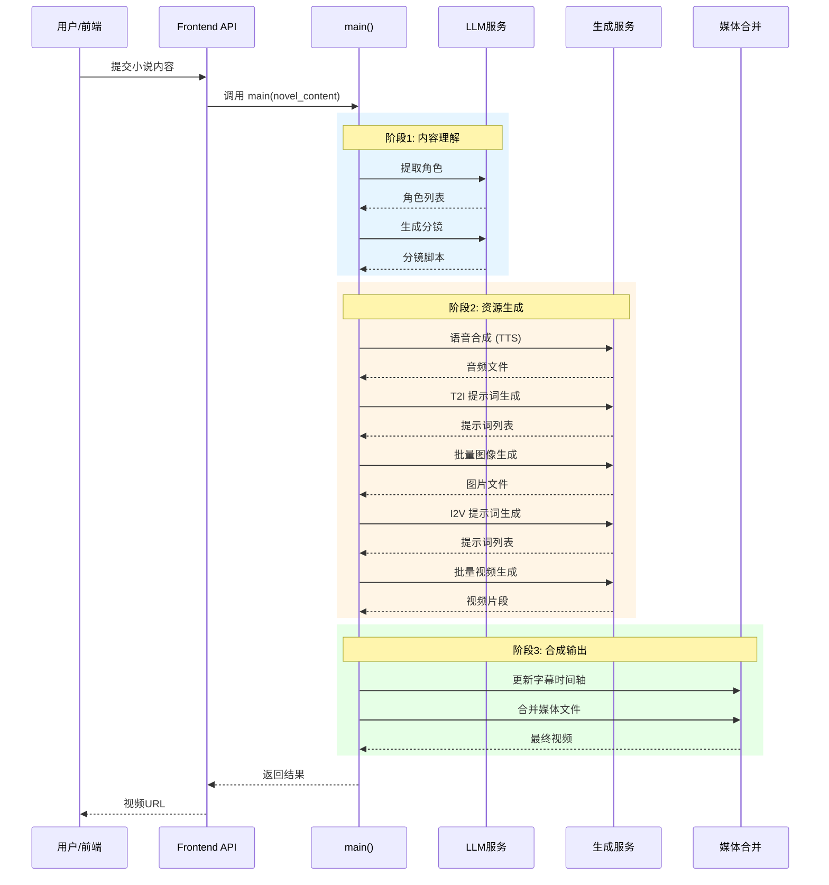
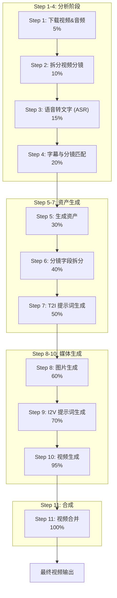
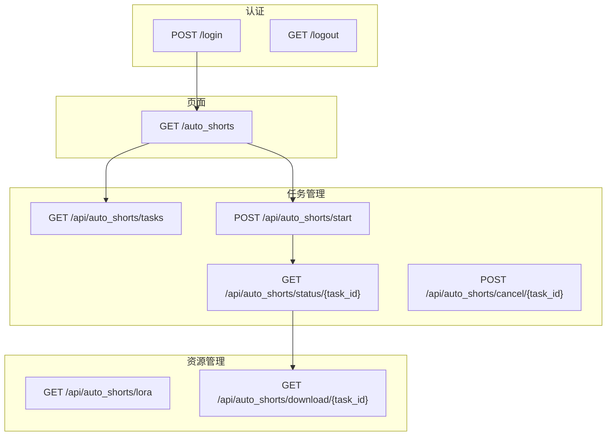
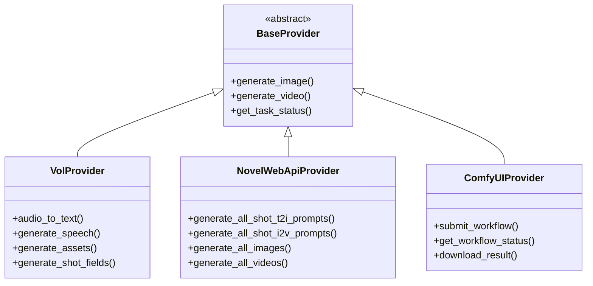
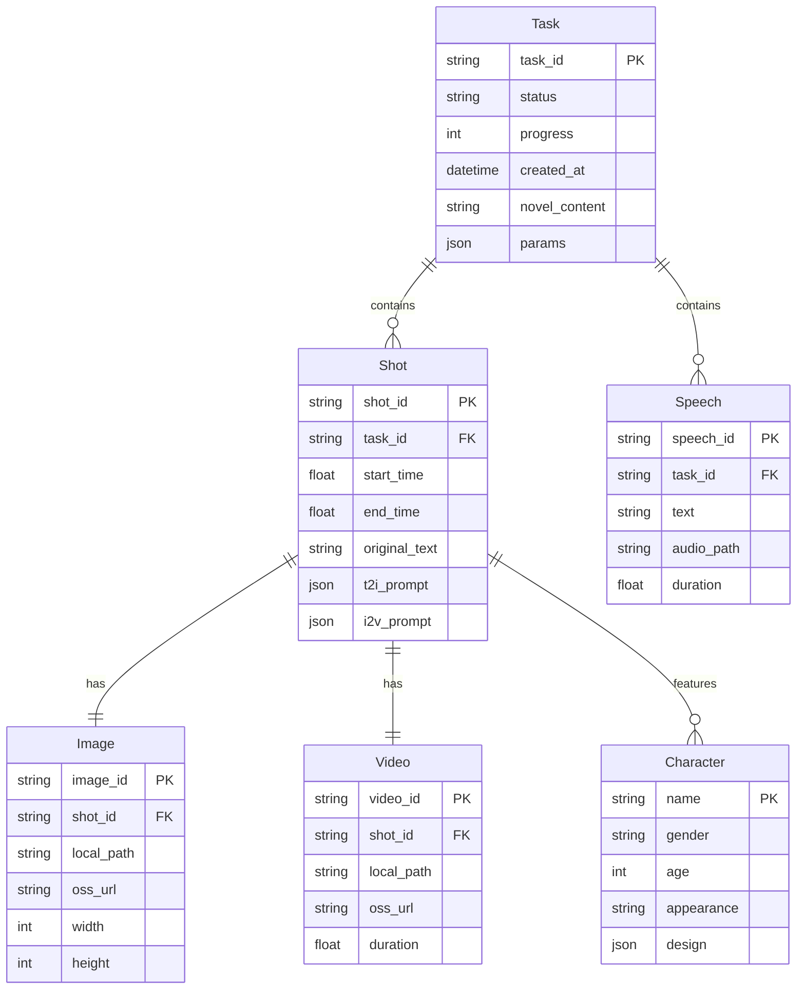
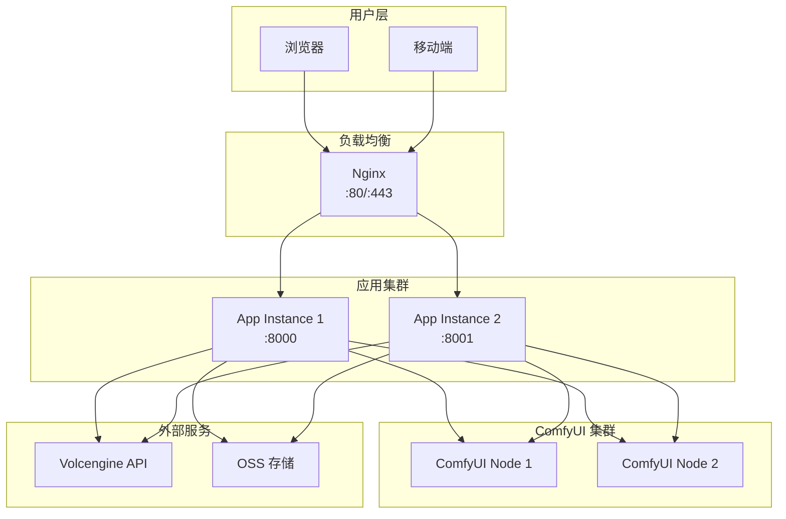

# Auto-Shorts API 设计文档

本文档详细描述 Auto-Shorts 系统的 API 设计架构，包括核心 API 接口、`short_auto` 模块集成以及完整的系统架构。

---

## 1. 系统概述

Auto-Shorts 是一个 **AI 驱动的短视频自动生成平台**，支持两种主要工作模式：

| 模式 | 功能描述 | 入口模块 |
|------|----------|----------|
| **小说转视频** | 将文本内容转换为分镜视频 | `short_auto/main.py` → `main()` |
| **视频复刻** | 分析现有视频并基于AI重新生成 | `short_auto/main.py` → `main_new()` |

---

## 2. 系统架构图



---

## 3. API 分层架构

### 3.1 V1 API (`/api/v1/*`)

> [!NOTE]
> V1 API 提供分步骤的细粒度接口，适合需要精确控制生成流程的场景。

#### 3.1.1 分镜与角色管理

| 接口 | 方法 | 路径 | 功能 |
|------|------|------|------|
| 生成分镜 | POST | `/api/v1/storyboard` | 根据文本生成分镜脚本 |
| 提取角色 | POST | `/api/v1/character` | 从文本中提取并丰富角色信息 |
| 编辑角色 | POST | `/api/v1/character/edit` | 根据 Brief 更新角色设定 |
| 创建角色 | POST | `/api/v1/character/create` | 基于模板创建新角色 |

#### 3.1.2 提示词生成

| 接口 | 方法 | 路径 | 功能 |
|------|------|------|------|
| T2I 提示词 | POST | `/api/v1/t2i_prompt` | 生成文生图提示词 |
| I2V 提示词 | POST | `/api/v1/i2v_prompt` | 生成图生视频提示词 |

#### 3.1.3 分镜编辑

| 接口 | 方法 | 路径 | 功能 |
|------|------|------|------|
| 编辑分镜 | POST | `/api/v1/shot/edit` | 根据意图更新分镜 |
| 创建分镜 | POST | `/api/v1/shot/create` | 基于模板创建新分镜 |

#### 3.1.4 媒体生成

| 接口 | 方法 | 路径 | 功能 |
|------|------|------|------|
| 生成图像 | POST | `/api/v1/image/generate` | 异步提交图像生成任务 |
| LoRA 列表 | GET | `/api/v1/lora/list` | 获取可用 LoRA 模型 |

---

### 3.2 V2 API (`/api/v2/*`)

> [!TIP]
> V2 API 提供统一的多提供商、多模型接口，推荐新项目使用。

#### 3.2.1 统一图像生成

```json
POST /api/v2/image/generate
{
  "model_id": "comfyui:qwen_v0.0.1",
  "positive_prompt": "少女在樱花树下微笑",
  "negative_prompt": "模糊, 变形",
  "width": 1280,
  "height": 720,
  "lora_uuid": "wrz/吉卜力风格"
}
```

#### 3.2.2 统一视频生成

```json
POST /api/v2/video/generate
{
  "model_id": "comfyui:wan2.2-i2v-lightx2v",
  "image_input": "https://oss.example.com/image.jpg",
  "positive_prompt": "少女转身微笑",
  "resolution": "1080p",
  "aspect_ratio": "16:9"
}
```

#### 3.2.3 V2 完整接口列表

| 接口 | 方法 | 路径 | 功能 |
|------|------|------|------|
| 统一图像生成 | POST | `/api/v2/image/generate` | 多模型文生图 |
| 图生图 | POST | `/api/v2/image/from_image` | 基于图片编辑生成 |
| 统一视频生成 | POST | `/api/v2/video/generate` | 多模型图生视频 |
| 首尾帧视频 | POST | `/api/v2/video/from_frames` | 基于首尾帧生成视频 |
| 参考图视频 | POST | `/api/v2/video/from_references` | 多参考图生成视频 |
| 唇语同步 | POST | `/api/v2/video/lip_sync` | 视频唇语同步 |
| 语音合成 | POST | `/api/v2/tts/generate` | 文本转语音 |
| 音色列表 | GET | `/api/v2/tts/vocals` | 获取可用音色 |
| 任务状态 | GET | `/api/v2/task/{task_id}` | 查询异步任务状态 |

---

## 4. short_auto 模块详解

### 4.1 模块架构



### 4.2 小说转视频流程 (`main()`)



### 4.3 视频复刻流程 (`main_new()`)

> [!IMPORTANT]
> `main_new()` 是短视频复刻的核心函数，支持 11 个步骤的断点续传。



### 4.4 断点续传机制

```python
class CacheManager:
    """缓存管理器 - 支持断点续传"""
    
    def __init__(self, task_id: str):
        self.task_id = task_id
        self.cache_dir = Path("tmp") / task_id
    
    def save(self, step_name: str, data: Any) -> None:
        """保存步骤数据到缓存"""
        
    def load(self, step_name: str) -> Optional[Any]:
        """从缓存加载步骤数据"""
        
    def clear(self) -> None:
        """清除所有缓存"""
```

进度追踪通过 `progress.txt` 文件实现：

| 步骤 | 进度百分比 | 描述 |
|------|------------|------|
| step1_download | 5% | 下载视频&音频 |
| step2_shot_split | 10% | 拆分视频分镜 |
| step3_asr | 15% | 语音转文字 |
| step4_subtitle_match | 20% | 字幕与分镜匹配 |
| step5_assets | 30% | 生成资产 |
| step6_shot_fields | 40% | 分镜字段拆分 |
| step7_t2i_prompts | 50% | 图片提示词生成 |
| step8_images | 60% | 图片生成 |
| step9_i2v_prompts | 70% | 视频提示词生成 |
| step10_videos | 95% | 视频生成 |
| step11_merge | 100% | 视频合并 |

---

## 5. Frontend API (`/api/auto_shorts/*`)

### 5.1 前端接口架构



### 5.2 任务启动请求

```json
POST /api/auto_shorts/start
{
  "novel_content": "https://www.douyin.com/video/xxx",
  "genre_type": "现代都市",
  "art_style": "新海诚风格",
  "image_width": 1280,
  "image_height": 720,
  "lora_uuid": "wrz/吉卜力风格",
  "image_model_id": "comfyui:qwen_v0.0.1"
}
```

### 5.3 任务状态响应

```json
{
  "code": 0,
  "message": "success",
  "data": {
    "task_id": "uuid-xxx",
    "status": "running",
    "progress": 65,
    "progress_message": "视频提示词生成中...",
    "created_at": "2026-01-07T15:30:00",
    "result": null
  }
}
```

---

## 6. 提供商集成

### 6.1 提供商架构



### 6.2 支持的模型

| 提供商 | 模型 ID | 用途 |
|--------|---------|------|
| ComfyUI | `comfyui:qwen_v0.0.1` | 文生图 (T2I) |
| ComfyUI | `comfyui:z-image` | 文生图 (高质量) |
| ComfyUI | `comfyui:wan2.2-i2v-lightx2v` | 图生视频 (I2V) |
| ComfyUI | `comfyui:lip_sync` | 唇语同步 |
| Volcengine | `volcengine:tts` | 语音合成 |
| Volcengine | `volcengine:asr` | 语音识别 |
| Hailuo | `hailuo:text2speech_v2.6-hd` | 高质量语音合成 |

---

## 7. 数据模型

### 7.1 核心数据结构



### 7.2 请求/响应 Schema

#### StandardResponse

```python
class StandardResponse(BaseModel):
    code: int = 0           # 0=成功, 非0=失败
    message: str = "success"
    data: Optional[Any] = None
```

#### ImageGenerationRequest

```python
class ImageGenerationRequest(BaseModel):
    positive_prompt: str
    negative_prompt: Optional[str] = ""
    width: int = 1280
    height: int = 720
    lora_uuid: Optional[str] = ""
    model_id: Optional[str] = "comfyui:qwen_v0.0.1"
```

#### UnifiedVideoRequest

```python
class UnifiedVideoRequest(BaseModel):
    model_id: Optional[str] = None
    provider: Optional[str] = None
    model: Optional[str] = None
    image_input: str              # OSS URL 或 Base64
    positive_prompt: str
    negative_prompt: Optional[str] = ""
    resolution: Optional[str] = "1080p"
    aspect_ratio: Optional[str] = "16:9"
    duration: Optional[float] = 5.0
```

---

## 8. 错误处理

### 8.1 错误码规范

| Code | 含义 | 处理建议 |
|------|------|----------|
| 0 | 成功 | - |
| 400 | 请求参数错误 | 检查请求体 |
| 401 | 未认证 | 重新登录 |
| 404 | 资源不存在 | 检查 ID |
| 500 | 服务器内部错误 | 联系管理员 |
| 1001 | 任务已取消 | 重新提交 |
| 1002 | 生成超时 | 重试或降低参数 |
| 1003 | 模型不可用 | 切换模型 |

### 8.2 重试策略

```python
# 服务内置重试机制
max_retries = 3
retry_delay = 1.0
backoff_factor = 2.0  # 指数退避
```

---

## 9. 部署架构



---

## 10. 使用示例

### 10.1 完整视频复刻流程

```python
import httpx
import asyncio

async def replicate_video(video_url: str):
    async with httpx.AsyncClient(base_url="http://localhost:8000") as client:
        # 1. 启动任务
        resp = await client.post("/api/auto_shorts/start", json={
            "novel_content": video_url,
            "art_style": "新海诚风格",
            "image_model_id": "comfyui:qwen_v0.0.1"
        })
        task_id = resp.json()["data"]["task_id"]
        
        # 2. 轮询状态
        while True:
            status = await client.get(f"/api/auto_shorts/status/{task_id}")
            data = status.json()["data"]
            print(f"进度: {data['progress']}% - {data['progress_message']}")
            
            if data["status"] == "completed":
                return data["result"]["final_video_path"]
            elif data["status"] == "failed":
                raise Exception(data["error"])
            
            await asyncio.sleep(5)

# 运行
result = asyncio.run(replicate_video("https://www.douyin.com/video/xxx"))
print(f"最终视频: {result}")
```

### 10.2 使用 V2 API 单独生成图片

```python
import httpx

resp = httpx.post("http://localhost:8000/api/v2/image/generate", json={
    "model_id": "comfyui:qwen_v0.0.1",
    "positive_prompt": "一位年轻女孩站在樱花树下，阳光透过花瓣洒落",
    "negative_prompt": "模糊, 变形, 低质量",
    "width": 1280,
    "height": 720,
    "lora_uuid": "wrz/吉卜力风格（宫崎骏）-qwen_1.0.safetensors"
})

task_id = resp.json()["data"]["task_id"]
print(f"图片生成任务已提交: {task_id}")
```

---

## 11. 验证计划

本文档为设计文档，无需代码验证。

### 人工验证

1. **架构图检查**: 确认 Mermaid 图表正确渲染
2. **接口完整性**: 对照代码验证所有接口已记录
3. **数据模型**: 确认 ER 图与实际实现一致

---

> [!NOTE]
> 本文档基于代码库 `/Users/john/wkgit/auto-shorts` 分析生成，如有更新请同步维护。
